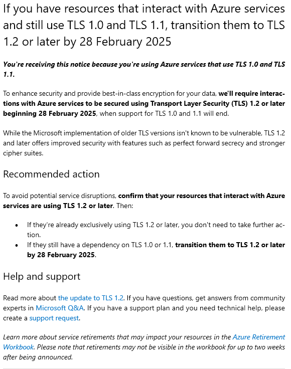

# Azure Resources TLS Versions ✨

## Summary 📩

You're probably here because you received the dreaded Microsoft email telling you that something is going out of support, and that means something might break. You've realized that TLS versions are probably scattered all over your Microsoft Azure environment, but there's no simple way of finding out which resources are running which version of TLS. Well... don't worry, because I've got your back! 💪 This script will help you easily identify which resources in your Azure environment are still using unsupported TLS versions (1.0 and 1.1) and help you get ahead of the February 2025 deadline. 🎯

<p align="center">
  
</p>

## Overview 🌐

The `AzureResourcesTLSVersions.ps1` script helps you scan your Azure resources, specifically Application Gateways and Storage Accounts, to detect outdated and unsupported TLS versions (1.0 and 1.1). With the end of support for these versions by Microsoft starting February 2025, this script will help you ensure your resources are compliant and secure.

## Key Features 🔑

- ✅ Detects and reports the TLS version used by Azure Storage Accounts and Application Gateways.
- ⚠️ Flags resources using unsupported TLS versions (1.0 and 1.1).
- 📊 Exports findings to a CSV file for documentation and further action.
- 🎮 Provides an interactive selection menu for resource types (Storage Accounts or Application Gateways).

## Prerequisites 🛠️

Before running the script, ensure the following:

- **Azure PowerShell** is installed and configured.
  - Install the Azure PowerShell module with the following command:

        ```powershell
        Install-Module -Name Az -AllowClobber -Force -SkipPublisherCheck
        ```

- **Azure CLI** is installed to retrieve SSL policy information from Application Gateways.
  - Download Azure CLI from [here](https://docs.microsoft.com/en-us/cli/azure/install-azure-cli).

- **Permissions**: Ensure you have the necessary permissions to read configurations of Storage Accounts and Application Gateways across Azure subscriptions.
- **PowerShell Version**: Version 7.x or higher is recommended for compatibility.

## Getting Started 🚀

1. **Clone or Download the Repository 📥**

     Clone or download the repository containing the `AzureResourcesTLSVersions.ps1` script to your local machine.

2. **Authenticate to Azure 🌟**

     Open a PowerShell window and authenticate to your Azure account:

     ```powershell
     Connect-AzAccount
     ```

3. **Run the Script ⚡**

     Execute the script by running the following in PowerShell:

     ```powershell
     .\AzureResourcesTLSVersions.ps1
     ```

4. **Select Resource Type 🛠️**

     The script will prompt you to select the resource type you want to scan:
     1. Azure Storage Accounts
     2. Azure Application Gateway

     You can choose the resource type by entering the number corresponding to your choice.

5. **Review Results 📈**

     Once the script completes the scan, it will display the results in the PowerShell window. Resources using TLS 1.0 or 1.1 will be highlighted in Red. The script will also export a CSV file containing the details of the scanned resources and their TLS configurations.

     **Example Output:**

     ```powershell
     Checking resource group: myResourceGroup
     Storage Account 'MyStorageAccount' - TLS Version: 1.0 (Unsupported) - Highlighted in Red
     Application Gateway 'MyAppGateway' - TLS Version: TLS 1.1 (Unsupported) - Highlighted in Red
     TLS version information exported to AzureApplicationGateway_ResourceTlsVersions_20250131_120000.csv
     ```

6. **Review the Exported CSV 🗃️**

     The script generates a CSV file with the following columns:
     - `SubscriptionId`: The subscription ID.
     - `SubscriptionName`: The name of the Azure subscription.
     - `ResourceGroupName`: The resource group containing the resource.
     - `ResourceName`: The name of the resource.
     - `MinimumTlsVersion`: The detected TLS version (if available).
     - `AvailableProtocols`: A list of available protocols for the resource.

## Important Notes ⚠️

- **TLS Version Support**: TLS 1.0 and 1.1 are deprecated by Microsoft starting in February 2025. Ensure all your resources support TLS 1.2 or higher to stay compliant and secure.
- **Error Handling**: The script includes error handling and will show warnings if TLS version information for any resource cannot be retrieved.

## Microsoft TLS End of Support 📅

This script references a Microsoft Support Email detailing the end of support for TLS 1.0 and 1.1. Be sure to review the email and act accordingly to update your resources before the support deadline.

## Additional Resources 📚

For more information on configuring and migrating to TLS 1.2 for Azure Storage, refer to the official Microsoft documentation [here](https://learn.microsoft.com/en-us/azure/storage/common/transport-layer-security-configure-migrate-to-tls2).

## Known Issues 🚨

- **No TLS version found**: If no TLS version is found for a resource, the script will display the message: "No valid TLS version found."
- **Resources not found**: If no resources are found in the selected subscription or resource group, a warning message will be shown.

## Contributing 🤝

If you'd like to contribute to the project, feel free to fork the repository and submit pull requests. We welcome bug fixes, new features, and support for additional resource types.

## License 📝

This project is licensed under the MIT License - see the LICENSE file for details.
